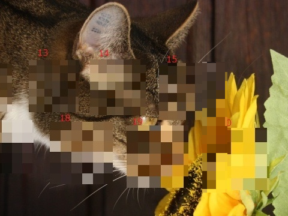
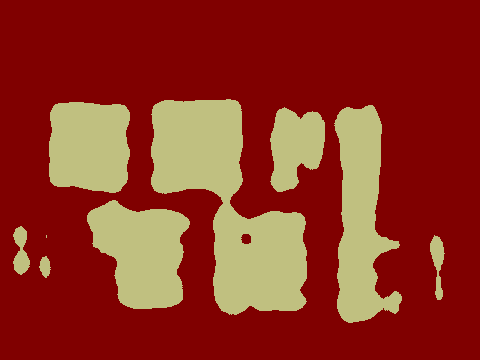

以前に以下でOpenCVなどを駆使して力技でモザイク検知をしたが、今度は機械学習でやってみる。
* https://qiita.com/summer4an/items/306acc5d38169f880ba8
* https://github.com/summer4an/mosaic_detector

Deep Learning CNNのsemantic segmentationを使った。
semantic segmentationについては以下等参照。
* http://postd.cc/semantic-segmentation-deep-learning-review/
* https://www.slideshare.net/takmin/semantic-segmentation

FCNやDeepLab等いろいろなネットワークがあるが、TensorFlowでの実装があり動作させられた  
SegNetのものを利用する。  
SegNetの元論文。
* https://arxiv.org/abs/1511.00561
以下のコードを拝借。
* https://github.com/tkuanlun350/Tensorflow-SegNet

画像データはターゲットのモザイクを含むpngファイルと、  
モザイクの位置を示す答えのpngファイルが必要。

答えのpngはsemantic segmentationでは一般的(？)な形式で、  
ラベル部分(ラベルの順に#000000、#010101、#020202…)に塗り分けられたもの。

今回の場合、モザイクでない部分は#000000で、モザイク部分だけ#010101で塗って学習させてみたが、  
うまく判別できず(開発途中だったためこれが原因ではないかも)。  
背景は#010101、モザイク部分は#020202で塗ったところうまくいった。

手順。
* 元画像を用意。train、valid、test用にそれぞれ500枚程度。
* 001_mosaic_kakeru.shを使ってモザイクをかけたものと、かけた部分を表す答えのpngを作る。
* 100_list_maker.shでファイルリストを作成。
* 101_gakusyuu.shで学習。NVIDIA GTX 1060を使い、20000イテレーションで5時間程度。
* ログディレクトリにできた連番名付きのckptファイルを201_move_model.shで連番名無しに。
* 202_hantei.shでtest用のファイルを判定。元画像と同じディレクトリに生成される。

以下が実際に判別させたもの。  
(画像は http://gahag.net/011032-cat-sunflower-smell/ より拝借)

 

精度は完全とは言えないがまあまあか。
